# 学生考勤管理系统

这是一个安卓学生考勤管理系统，旨在为学生和教师提供便捷的考勤管理功能。系统分为学生端和教师端，各自拥有不同的功能模块以满足其特定需求。

完整源码获取：https://faka.gzicreate.top/buy/313

## **项目功能详细介绍**

### **核心功能模块**

#### **1. 用户认证与管理**

-   **登录功能:** 支持学生和教师通过学号/工号和密码进行登录，实现用户身份验证。
-   **学生信息管理 (教师端):**
    -   **添加学生:** 教师可以录入新的学生信息，包括学号、姓名、专业等。
    -   **编辑学生:** 教师可以修改现有学生的信息。
    -   **学生列表:** 展示所有学生的基本信息。

#### **2. 考勤管理**

-   **扫码签到 (学生端):** 学生可以通过扫描教师端生成的二维码进行快速签到，记录考勤状态。
-   **发起考勤 (教师端):** 教师可以发起新的考勤活动，生成供学生扫描的二维码。
-   **考勤记录查询:**
    -   **学生端:** 学生可以查看自己的历史打卡记录，了解每日考勤详情。
    -   **教师端:** 教师可以查看所有学生的考勤记录，按日期、学生等条件进行筛选。

#### **3. 请假管理**

-   **提交请假申请 (学生端):** 学生可以提交请假申请，填写请假类型、起止时间、请假原因等信息，并支持上传图片。
-   **我的请假 (学生端):** 学生可以查看自己提交的所有请假申请的状态和详情。
-   **请假审批 (教师端)::** 教师可以查看待审批的请假申请，并进行审批操作（批准或驳回）。

#### **4. 数据统计与分析**

-   **考勤统计 (学生端):**
    -   提供学生个人每月考勤数据的统计概览。
    -   以柱状图形式展示每月出勤、缺勤、迟到、请假等状态的占比。
    -   支持按年份筛选查看历史考勤数据。
-   **考勤统计 (教师端)::**
    -   提供管理员视角的整体考勤统计。
    -   以饼状图等形式展示总体的考勤状态分布。

## **技术架构**

本系统采用跨平台开发框架，结合本地数据库进行数据存储与管理。整个架构可以概括为以下几个主要层级：

### **1. 表现层 (Presentation Layer)**

-   **技术:** Dart
-   **职责:** 负责用户界面的构建和交互逻辑。包括学生端和教师端的所有页面、组件、导航以及用户输入处理。
-   **主要文件/模块:** `lib/screens/` 下的各种 `_screen` 文件，如 `login_screen `, `student_home_screen `, `teacher_dashboard ` 等。
-   **图表展示:** 利用 `fl_chart` 库将考勤统计数据可视化为柱状图和饼状图。

### **2. 业务逻辑层 (Business Logic Layer)**

-   **技术:** Dart
-   **职责:** 处理应用程序的核心业务规则和逻辑。包括用户认证、考勤签到逻辑、请假申请与审批流程、数据统计计算等。
-   **主要文件/模块:** 散布在各个屏幕的 `_State` 类中，直接与数据层进行交互。

### **3. 数据访问层 (Data Access Layer)**

-   **技术:** Dart, `sqflite`
-   **职责:** 负责应用程序与本地数据库的交互。提供统一的接口进行数据的增、删、改、查操作。处理数据库的初始化、版本升级以及事务管理。
-   **主要文件/模块:** `lib/utils/database_helper `。

### **4. 数据存储层 (Data Storage Layer)**

-   **技术:** SQL
-   **职责:** 实际存储应用程序的数据，包括学生信息、教师信息、考勤记录、请假记录等。
-   **主要文件/模块:** 位于设备存储上的 SQL 数据库文件。

### **技术架构流程图**
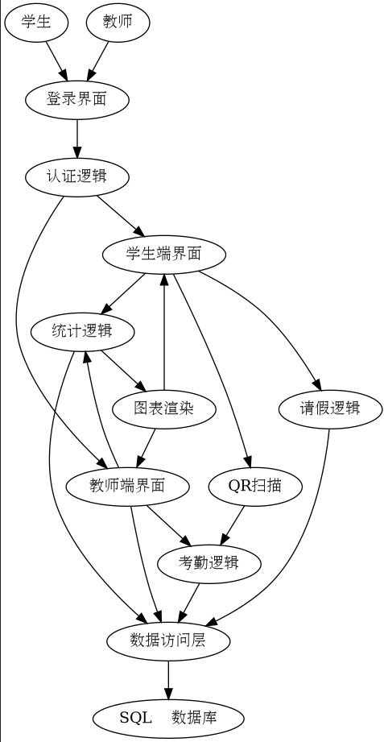


**说明:**

这是一个分层架构，旨在实现清晰的职责分离和模块化。

-   **用户 (学生/教师):** 系统的直接使用者，通过登录界面进入学生端或教师端界面。
-   **客户端 (Flutter 应用):**
    -   **登录界面 (LoginScreen):** 负责用户身份验证的入口。
    -   **学生端/教师端界面 (StudentUI/TeacherUI):** 根据用户角色展示不同的功能模块和用户界面。
    -   **业务逻辑层:** 包含处理特定业务场景的逻辑模块。
        -   **认证逻辑 (AuthLogic):** 处理用户登录、身份验证等功能。
        -   **考勤逻辑 (AttendanceLogic):** 处理考勤签到、发起考勤、考勤记录查询等。
        -   **请假逻辑 (LeaveLogic):** 处理请假申请的提交、查询、审批等。
        -   **统计逻辑 (StatisticsLogic):** 处理考勤数据的聚合、计算和为图表准备数据。
    -   **数据访问层 (DatabaseHelper):** 作为业务逻辑层和数据存储层的桥梁，封装了所有与本地 SQLite 数据库的交互细节。
    -   **外部集成:**
        -   **`mobile_scanner` (QR 扫描):** 负责调用设备摄像头进行二维码扫描，并将结果传递给考勤逻辑。
        -   **`fl_chart` (图表渲染):** 负责将统计逻辑准备好的数据渲染成直观的柱状图、饼状图等。
-   **数据存储 (本地 SQLite 数据库):** 应用程序的所有持久化数据（如用户、考勤记录、请假申请）都安全地存储在此本地数据库中。

**交互流程示例:**

1.  **用户登录:** 用户在 `LoginScreen` 输入凭据 -> `AuthLogic` 处理验证 -> 成功后跳转到 `StudentUI` 或 `TeacherUI`。
2.  **学生扫码签到:** `StudentUI` 触发 `MobileScanner` -> 扫描成功后将考勤 ID 传递给 `AttendanceLogic` -> `AttendanceLogic` 调用 `DatabaseHelper` 记录考勤数据。
3.  **教师查看考勤统计:** `TeacherUI` 触发 `StatisticsLogic` -> `StatisticsLogic` 从 `DatabaseHelper` 获取原始数据 -> `StatisticsLogic` 处理数据并交给 `FlChart` 渲染 -> `FlChart` 在 `TeacherUI` 上显示图表。

### **技术亮点与实现细节**

-   **Flutter 跨平台开发:** 利用 Flutter 框架实现了一套代码库，同时支持 Android 和 Windows 平台。
-   **SQLite 数据库 (`sqflite`):** 使用 `sqflite` 作为本地数据库解决方案，管理学生、教师、考勤记录和请假申请等数据。
    -   **数据库版本管理:** 通过 `onUpgrade` 回调机制，支持数据库平滑升级，确保在应用更新时数据结构的兼容性。
-   **图表可视化 (`fl_chart`):** 集成 `fl_chart` 库，用于绘制美观、交互性强的柱状图和饼状图，直观展示考勤数据。
-   **QR 码扫描 (`mobile_scanner`):** 利用 `mobile_scanner` 库实现了高性能的二维码扫描功能，提升学生签到体验。
-   **UI/UX 优化:**
    -   学生端和教师端采用不同的 AppBar 和 BottomNavigationBar 样式，提供清晰的视觉区分。
    -   扫码签到界面进行了美化，包括透明 AppBar、手电筒切换、现代扫描框以及签到成功后的视觉反馈。
    -   数据加载和处理中加入了错误处理和加载指示，提升用户体验。
-   **数据模拟:** 包含用于测试和演示的临时数据生成逻辑 (`main `)，方便快速启动和验证各项功能。

### **未来可扩展性**

-   可以进一步完善教师端的学生管理功能，例如批量导入学生信息。
-   增加消息通知功能，例如请假审批结果通知、考勤提醒等。
-   集成后端服务，实现云端数据存储和多设备同步。
-   增加用户权限管理，细化教师对不同班级或课程的管理权限。
-   优化统计图表的交互和数据维度，提供更深入的数据分析。

## **安装与运行**

本节介绍如何安装项目依赖并在本地运行应用程序。

### **环境准备**

1.  **安装 Flutter SDK:** 确保您的开发环境中已安装 Flutter SDK。您可以访问 [Flutter 官方网站](https://flutter.dev/docs/get-started/install) 获取详细的安装指南。
2.  **配置 Flutter 环境:** 运行 `flutter doctor` 命令，确保所有必要的开发工具（如 Android Studio, VS Code, Git 等）均已正确安装和配置。

### **项目设置**

1.  **克隆仓库:**
    ```bash
    git clone [你的仓库地址]
    cd 学生考勤管理系统
    ```
    (请将 `[你的仓库地址]` 替换为实际的 Git 仓库地址)

2.  **获取依赖:**
    在项目根目录下运行以下命令，获取所有 Flutter 依赖包：
    ```bash
    flutter pub get
    ```

### **运行应用程序**

#### **在 Windows 上运行 (桌面版)**

1.  **启用 Windows 支持:**
    如果尚未启用，请在项目根目录下运行：
    ```bash
    flutter enable-windows-desktop
    ```
2.  **运行应用:**
    ```bash
    flutter run -d windows
    ```
    这将会在您的 Windows 机器上启动应用程序的调试版本。

#### **在 Android 设备**

1.  **准备设备:** 确保您已连接 Android 设备（并开启 USB 调试）或启动了 Android 模拟器。
2.  **运行应用:**
    ```bash
    flutter run
    ```
    Flutter 会自动检测可用的 Android 设备或模拟器并部署应用程序。

#### **生成 APK (Android 包)**

如果您想生成用于发布或直接安装到 Android 设备的 APK 文件，可以运行以下命令：

1.  **构建 APK:**
    ```bash
    flutter build apk --release
    ```
    这会生成一个发布模式的 APK 文件，通常位于 `build/app/outputs/flutter-apk/app-release.apk`。

---

## **项目截图文件说明**

以下是 `image/学生` 和 `image/教师` 文件夹中的截图文件列表，这些图片通常用于展示应用程序的界面和功能。

**`image/学生` 文件夹内容:**

-   `我的请假.jpg`
-   `打开记录.jpg`
-   `扫码签到.jpg`
-   `提交请假申请.jpg`
-   `登录.jpg`
-   `考勤统计.jpg`

### 学生端界面截图

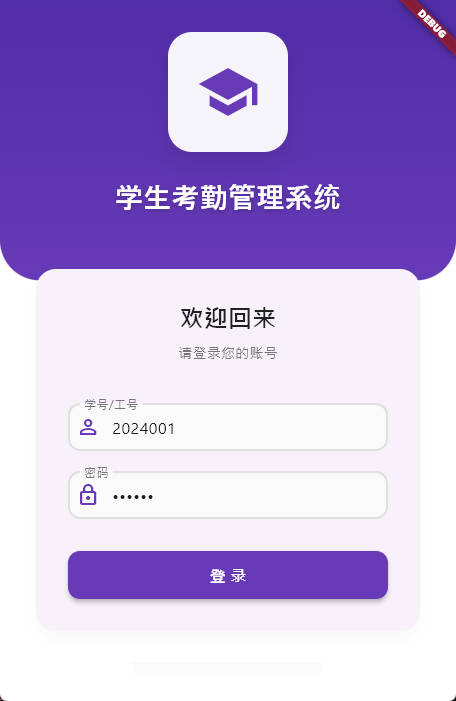
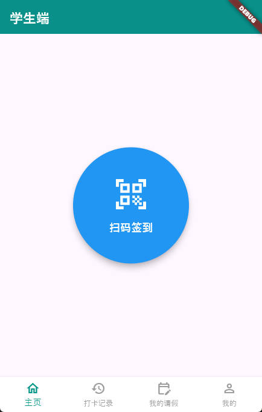
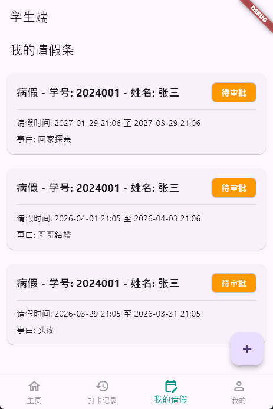
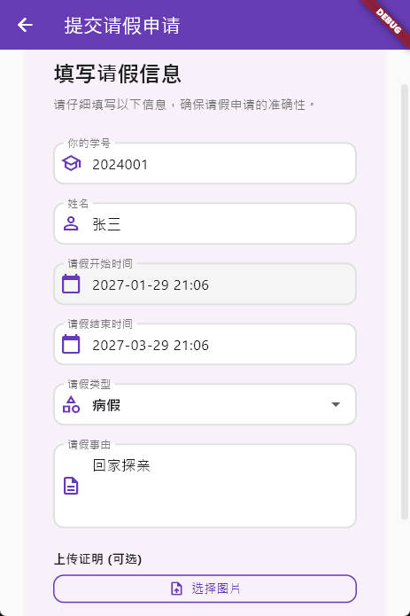
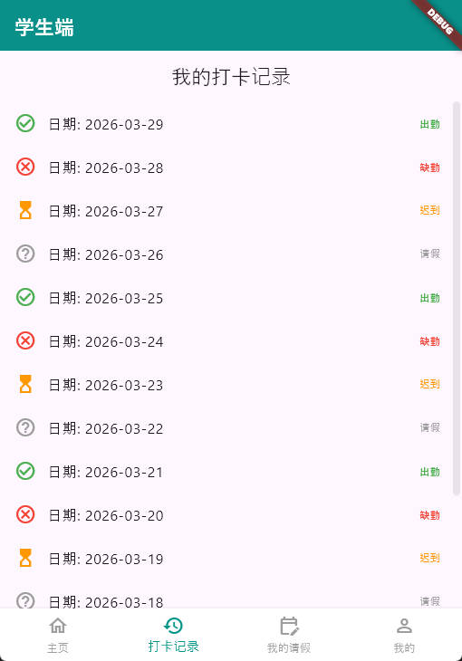
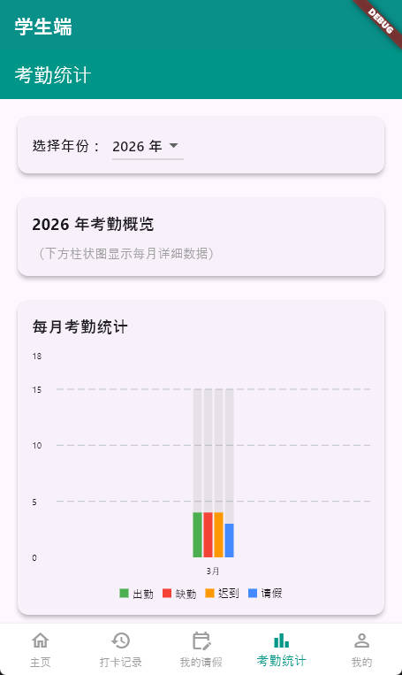

**`image/教师` 文件夹内容:**

-   `发起考勤.jpg`
-   `学生管理.jpg`
-   `我的.jpg`
-   `教师主页.jpg`
-   `教师信息.jpg`
-   `添加学生.jpg`
-   `编辑学生.jpg`
-   `考勤统计.jpg`
-   `考勤记录.jpg`

### 教师端界面截图

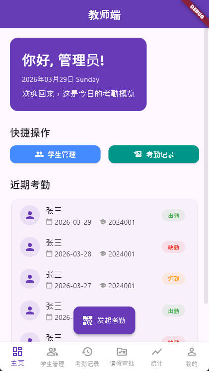

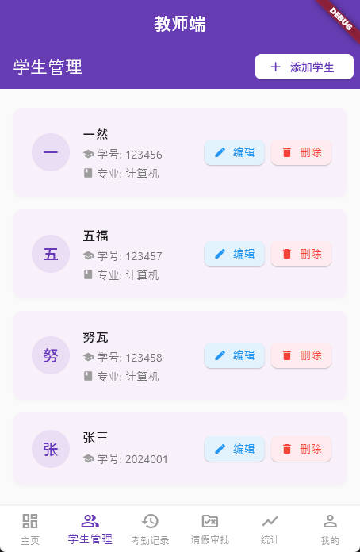
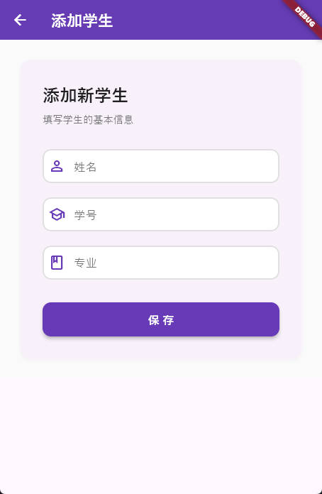
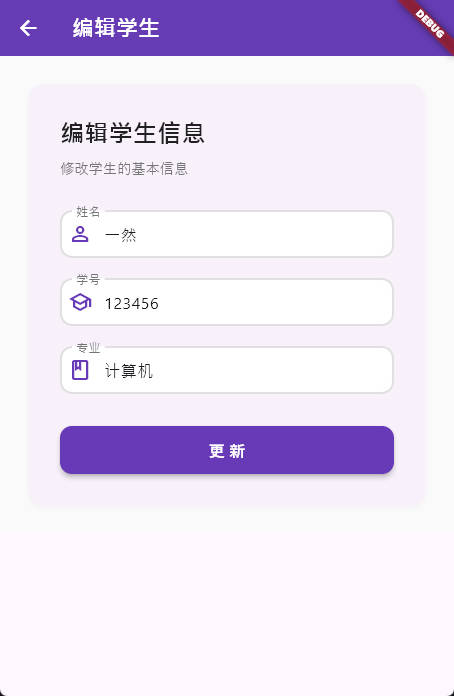
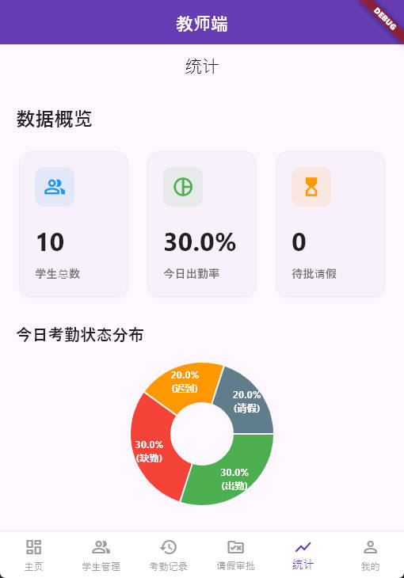
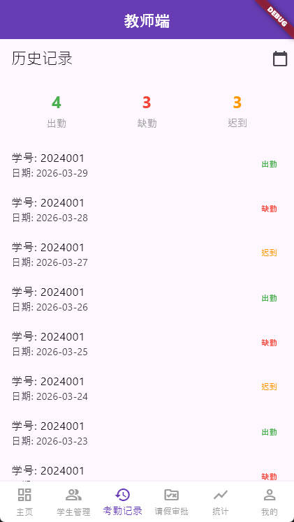
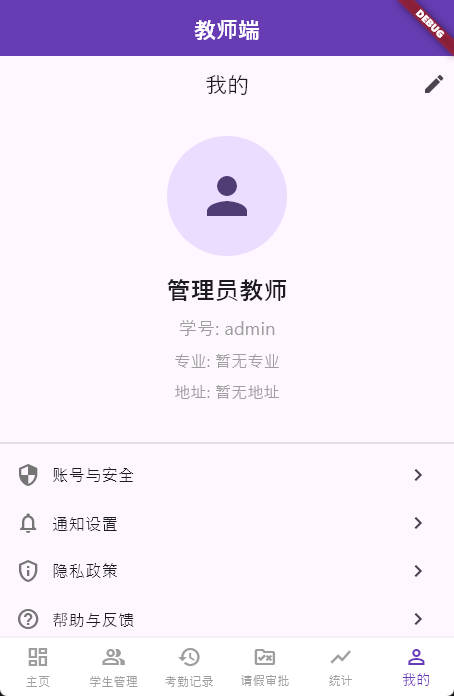
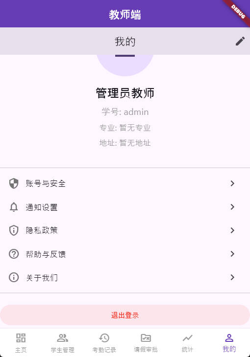

# 关于我
 本项目为开源项目，允许作为毕业设计、课程合计、二次开发使用。
### 如遇到部署或源码问题,咨询微信：GLBY369
